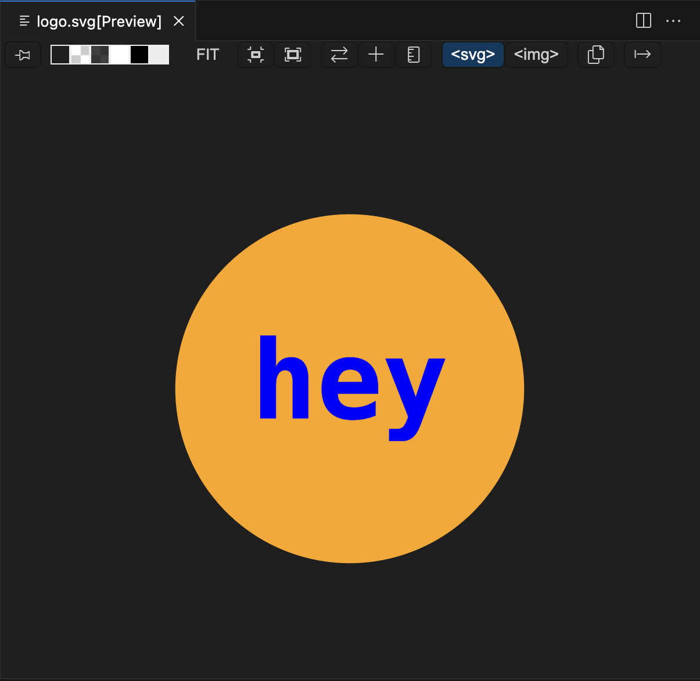
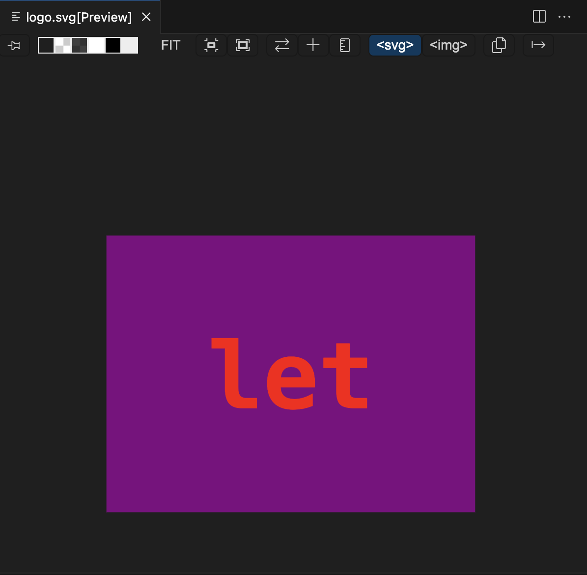
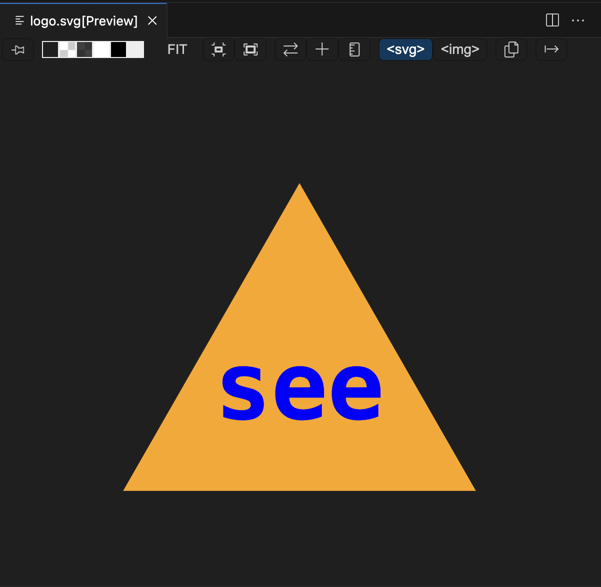

# logo-veloper

## Description

This logo make makes it easy for anyone to generate a logo for their project/company/etc. The logo maker will prompt the user with multiple questions to creating a logo they would want. It then return a logo svg based on their answers to the prompted questions.

## User Story 

AS a freelance web developer
I WANT to generate a simple logo for my projects
SO THAT I don't have to pay a graphic designer

## Acceptance Criteria

GIVEN a command-line application that accepts user input

WHEN I am prompted for text

THEN I can enter up to three characters

WHEN I am prompted for the text color

THEN I can enter a color keyword (OR a hexadecimal number)

WHEN I am prompted for a shape

THEN I am presented with a list of shapes to choose from: circle, triangle, and square

WHEN I am prompted for the shape's color

THEN I can enter a color keyword (OR a hexadecimal number)

WHEN I have entered input for all the prompts

THEN an SVG file is created named `logo.svg`

AND the output text "Generated logo.svg" is printed in the command line

WHEN I open the `logo.svg` file in a browser

THEN I am shown a 300x200 pixel image that matches the criteria I entered

## Screenshots/Video

<video src="examples/Logo.mp4" controls title="Logo-demostration"></video>

## Usage Instruction

1. Clone the github repository
2. Open up the code and right click on "index.js" to open it in integrated terminal
3. Type in "npm i"
4. Type in "node index.js"
5. Answer the prompted questions
6. View the generated logo.svg in examples folder. 
7. download SVG to preview SVG

## Installation

1. Have a github account
2. Download the zip code
3. Have terminal and vs code to open it up on
4. Download node
5. Download inquirer
6. Download fs
7. Download jest

## Credits

1. Github
2. Terminal
3. Vs Code
4. Youtube videos
5. A classmate

## Author

My Github account: https://github.com/Kthao29